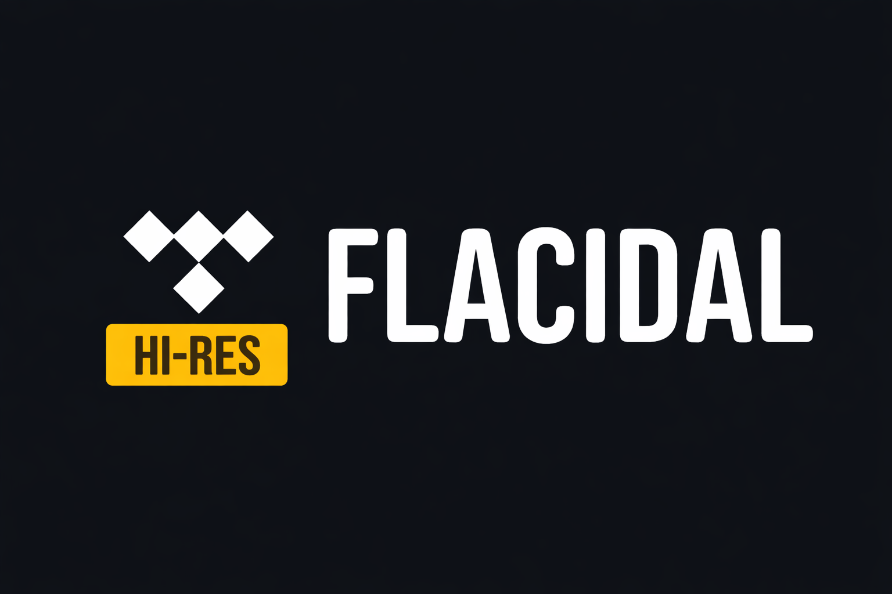
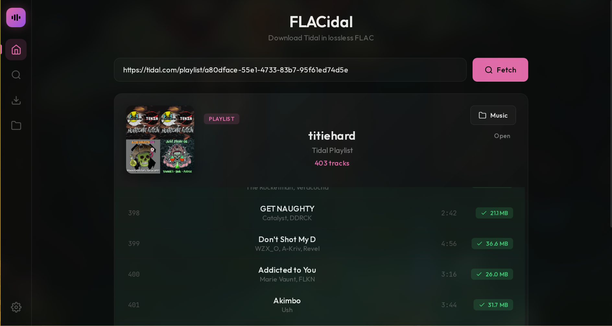

<div align="center">



### Download lossless FLAC music from Tidal & Qobuz

[](https://github.com/kushiemoon-dev/FLACidal/releases/latest)
[](https://codeberg.org/KushieMoon-dev/FLACidal)
[](LICENSE)
[](https://go.dev)


</div>

---

## Overview

**FLACidal** is a desktop application that downloads lossless FLAC audio directly from Tidal and Qobuz — no account credentials required. Paste a URL, choose a folder, and get Hi-Res 24-bit or Lossless 16-bit FLAC files with full metadata, embedded cover art, and customizable filename templates.

<div align="center">

</div>

---

## Features

- **Hi-Res & Lossless** — 24-bit up to 192 kHz (HI_RES) and 16-bit 44.1 kHz (LOSSLESS)
- **Tidal & Qobuz** — Full support for playlists, albums, tracks, mixes, and artist pages
- **Concurrent Downloads** — Up to 10 parallel downloads with real-time queue progress
- **Smart Metadata** — Automatic Vorbis comment tagging with embedded cover art
- **Built-in Search** — Search Tidal directly within the app without opening a browser
- **File Manager** — Download history, re-download support, and FLAC quality analyzer
- **Custom Templates** — Define your own filename format (e.g. `{artist} - {title}`)
- **Artist Artwork** — Download artist profile pictures alongside music
- **Proxy Support** — HTTP and SOCKS5 proxy for all outbound requests

---

## Download

**[⬇ Download Latest Release](https://github.com/kushiemoon-dev/FLACidal/releases/latest)**

| Platform | File |
|----------|------|
| Windows x64 | `flacidal.exe` |
| macOS Universal | `flacidal.dmg` |
| Linux x64 | `flacidal.AppImage` |
| **Android** | [`FLACidal.apk`](https://github.com/kushiemoon-dev/flacidal-mobile/releases/latest) |
| **iOS** | [`FLACidal.ipa`](https://github.com/kushiemoon-dev/flacidal-mobile/releases/latest) (via AltStore) |

> **New!** FLACidal is now available on mobile. Same features, same quality, on your phone.
> **[FLACidal Mobile →](https://github.com/kushiemoon-dev/flacidal-mobile)**

All releases on [GitHub](https://github.com/kushiemoon-dev/FLACidal/releases) · [Codeberg](https://codeberg.org/KushieMoon-dev/FLACidal/releases)

---

## Usage

1. Launch **FLACidal**
2. Paste a Tidal or Qobuz URL into the input field
3. Select your download folder
4. Click **Download All FLAC**

### Supported URLs

| Service | Supported Types |
|---------|----------------|
| **Tidal** | Playlist · Album · Track · Mix · Artist |
| **Qobuz** | Album · Playlist · Track |

---

## Output Structure

```
~/Music/
└── Playlist Name/
    ├── Artist - Track One.flac
    ├── Artist - Track Two.flac
    └── cover.jpg
```

---

## Configuration

Settings are stored at `~/.flacidal/config.json`.

| Setting | Default | Options |
|---------|---------|---------|
| Quality | `LOSSLESS` | `HI_RES` · `LOSSLESS` · `HIGH` |
| File naming | `{artist} - {title}` | Custom template |
| Embed cover art | `true` | `true` · `false` |
| Concurrent downloads | `4` | `1` – `10` |
| Proxy | _(none)_ | `http://...` or `socks5://...` |

---

## Build from Source

**Requirements:** [Go](https://go.dev) 1.21+ and [Wails](https://wails.io) v2

```bash
go install github.com/wailsapp/wails/v2/cmd/wails@latest
git clone https://codeberg.org/KushieMoon-dev/FLACidal.git
cd FLACidal
wails build
# Binary: build/bin/flacidal
```

Development mode with hot reload:

```bash
wails dev
```

---

## FAQ

**Do I need a Tidal or Qobuz account?**
No. FLACidal handles authentication internally. Just paste a URL and download.

**What audio quality is available?**
From Tidal: HI_RES (24-bit / up to 192 kHz) and LOSSLESS (16-bit / 44.1 kHz). From Qobuz: up to 24-bit depending on availability.

**Why does my antivirus flag the file?**
False positive. Go-compiled binaries are sometimes flagged heuristically. Build from source if you have concerns.

**Can I use a proxy?**
Yes. HTTP and SOCKS5 proxies are configurable in Settings.

---

## Star History

[](https://star-history.com/#kushiemoon-dev/FLACidal&Date)

### FLACidal Ecosystem

[](https://star-history.com/#kushiemoon-dev/FLACidal&kushiemoon-dev/flacidal-core&kushiemoon-dev/FLACidal-Mobile&Date)

---

## Disclaimer

FLACidal is intended for **educational and personal use only**. It is not affiliated with, endorsed by, or connected to Tidal, Qobuz, or any other streaming service. You are solely responsible for ensuring your use complies with local laws and the Terms of Service of the platforms involved. The software is provided "as is" without warranty of any kind.

---

<div align="center">

**MIT License** · [Releases](https://github.com/kushiemoon-dev/FLACidal/releases) · [Mobile App](https://github.com/kushiemoon-dev/flacidal-mobile) · [Codeberg](https://codeberg.org/KushieMoon-dev/FLACidal)

Made with ♥ by [KushieMoon](https://codeberg.org/KushieMoon-dev)

</div>
