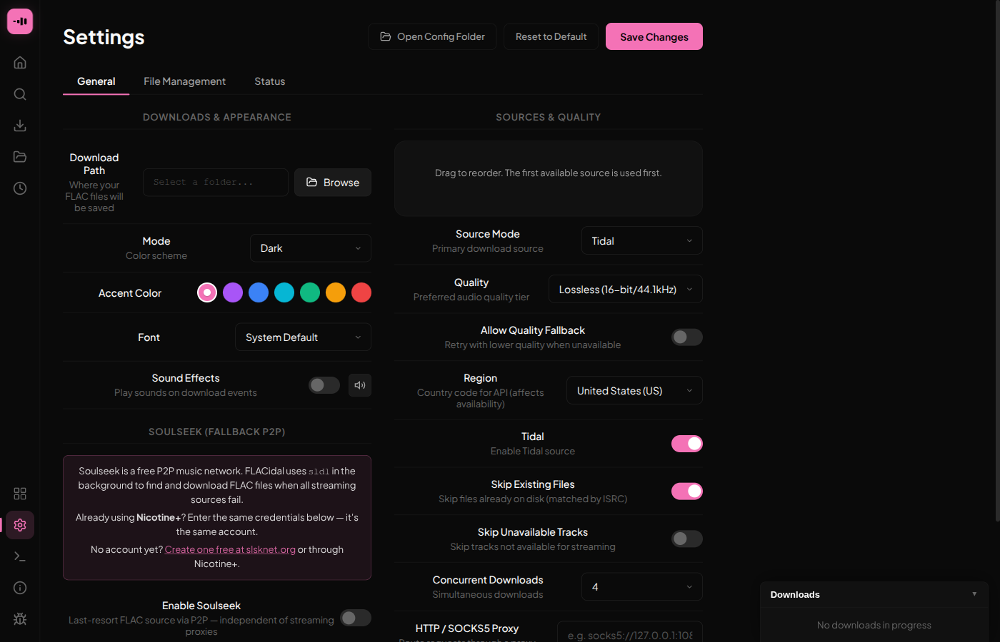
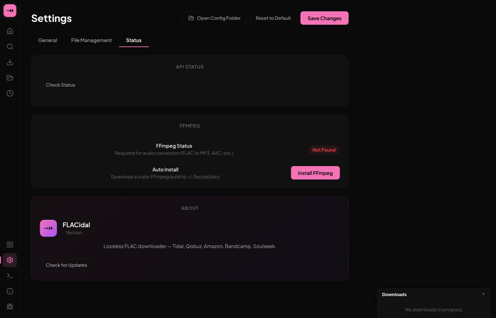
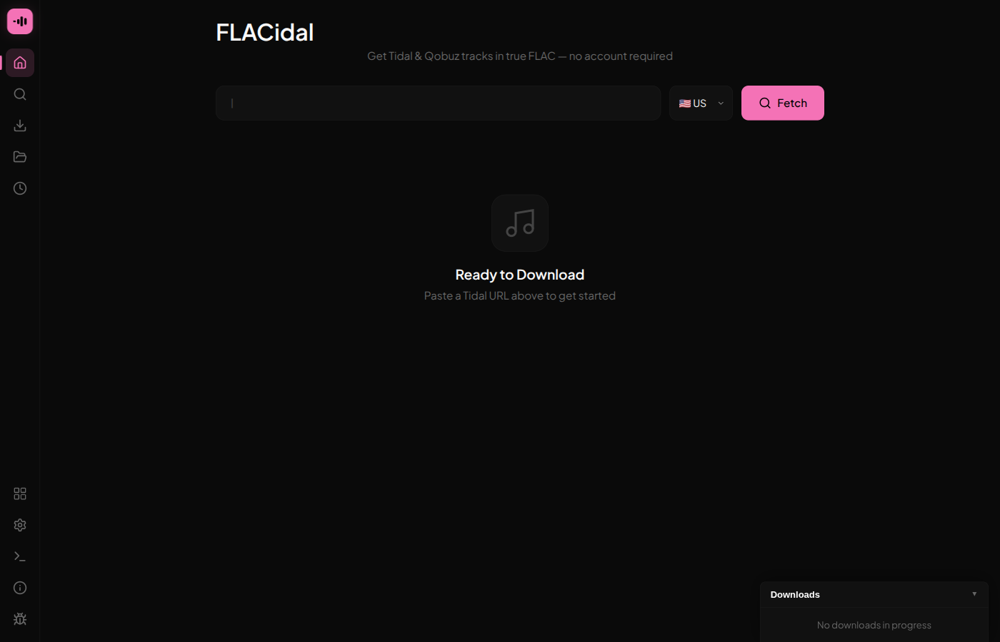
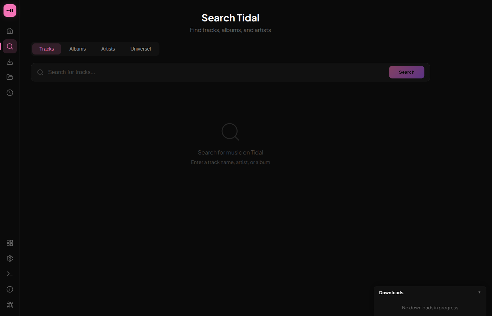
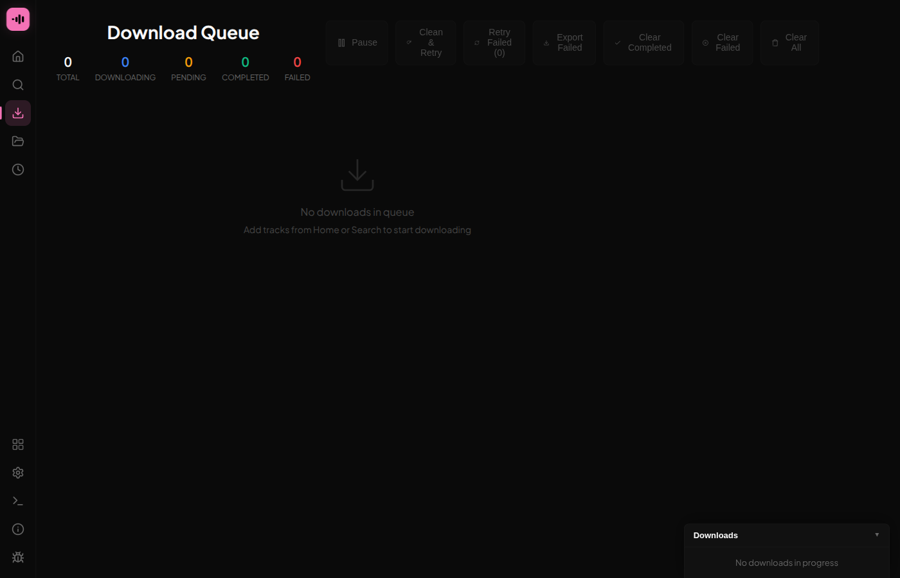

<div align="center">


### Download lossless FLAC music — multi-source, Soulseek P2P backbone

[](https://github.com/kushiemoon-dev/FLACidal/releases/latest)
[](LICENSE)
[](https://go.dev)


</div>

---

## Overview

**FLACidal** is a desktop application that downloads lossless FLAC files with full metadata and embedded cover art. It tries multiple sources in sequence — Tidal, Qobuz, Amazon Music, Bandcamp, and Soulseek P2P — and falls back automatically until one succeeds.

> **Note:** Tidal, Qobuz, and Amazon have significantly hardened their APIs against third-party access. The community proxy pools FLACidal uses to reach them go offline regularly, sometimes for days at a time. **Soulseek is currently the most reliable source for most downloads.** We strongly recommend setting it up before anything else — it takes 5 minutes and works independently of all proxy pool health.

---

## Quick Start

**1. [Download FLACidal](#download) for your platform**

**2. [Set up Soulseek](#setting-up-soulseek) — do this first**

**3. Paste a URL or search, then download**

```
Home tab  ->  paste a Tidal or Qobuz URL  ->  Fetch  ->  Download All FLAC
Search tab  ->  search by track / album / artist  ->  Download
```

Check **Settings -> Status** at any time to see which sources are currently online.

---

## How It Works

### Download chain

FLACidal tries each source in order and stops at the first success:

| Priority | Source | Quality | Notes |
|----------|--------|---------|-------|
| 1 | **Tidal** | FLAC / Hi-Res (24-bit) | Via community proxy pool |
| 2 | **Qobuz** | FLAC / Hi-Res (24-bit) | Via community proxy pool — optional |
| 3 | **Amazon Music** | FLAC / UHD | Via community proxy pool |
| 4 | **Bandcamp** | FLAC | Direct |
| 5 | **Soulseek P2P** | FLAC | Via `sldl` — requires a free account |

The source order can be adjusted in **Settings -> General -> Source Mode**.

### Two things called "proxy" — they are different

**Community proxy pool** — FLACidal's own relay infrastructure for Tidal, Qobuz, and Amazon. You do not configure this; it is built in. When these servers are down, those sources are unavailable.

**Outbound proxy (HTTP / SOCKS5)** — a personal network proxy you can route FLACidal's traffic through (corporate VPN, SOCKS5 tunnel, etc.). Most users do not need this. Configure it in **Settings -> General -> HTTP / SOCKS5 Proxy**.

### Source availability — what to expect

The major streaming platforms actively work to block unofficial API access. As a result:

- Proxy pools can go offline without warning
- Downloads may silently fall through to Soulseek as the final resort
- **Soulseek is currently the most consistently available source**

Check real-time endpoint health at any time in **Settings -> Status**.

---

## Features

- **Multi-Source Fallback** — Tidal, Qobuz, Amazon, Bandcamp, Soulseek — automatic cascade
- **Soulseek P2P** — P2P backbone independent of streaming proxy availability
- **Hi-Res and Lossless** — 24-bit / up to 192 kHz (Hi-Res) and 16-bit / 44.1 kHz (Lossless) from streaming sources
- **Tidal and Qobuz** — Full support for playlists, albums, tracks, mixes, and artist pages
- **Built-in Search** — Search Tidal (Tracks / Albums / Artists) or Deezer via the Universel tab (works even when Tidal is down)
- **Concurrent Downloads** — Up to 10 parallel downloads with real-time queue progress
- **Smart Metadata** — Vorbis comment tagging, embedded cover art, and lyrics
- **Audio Tools Suite** — Quality Analyzer, Resampler, Converter (via FFmpeg), and File Manager
- **Custom Filename Templates** — Define your own format, e.g. `{artist} - {title}`
- **Artist Artwork** — Download artist profile pictures alongside music
- **Source Status Panel** — Real-time endpoint health in Settings -> Status
- **Outbound Proxy Support** — HTTP and SOCKS5 for all outbound requests

---

## Download

**[Download Latest Release](https://github.com/kushiemoon-dev/FLACidal/releases/latest)**

| Platform | File |
|----------|------|
| Windows x64 | `flacidal.exe` |
| macOS Universal | `flacidal.dmg` |
| Linux x64 | `flacidal.AppImage` |
| **Android** | [`FLACidal.apk`](https://github.com/kushiemoon-dev/flacidal-mobile/releases/latest) |
| **iOS** | [`FLACidal.ipa`](https://github.com/kushiemoon-dev/flacidal-mobile/releases/latest) (via AltStore) |

> **Linux:** No AUR package exists. Use the AppImage directly or [build from source](#build-from-source).

FLACidal is also available on Android and iOS: **[FLACidal Mobile](https://github.com/kushiemoon-dev/flacidal-mobile)**

All releases on [GitHub](https://github.com/kushiemoon-dev/FLACidal/releases)

---

## Setting up Soulseek

Soulseek is FLACidal's most reliable source right now. Setup takes about 5 minutes.

### Step 1 — Get a Soulseek account

- **Already using Nicotine+?** Use your existing username and password — FLACidal uses the same account system.
- **New user:** Create a free account at [slsknet.org](https://www.slsknet.org/) (no email required) or through the Nicotine+ app.

### Step 2 — Install sldl

`sldl` (slsk-batchdl) is the command-line tool FLACidal uses to talk to the Soulseek network.

1. Download the latest binary for your platform from [github.com/fiso64/slsk-batchdl/releases](https://github.com/fiso64/slsk-batchdl/releases)
2. Place it at this exact path:
   - **Linux / macOS:** `~/.local/share/flacidal/sldl` — then make it executable: `chmod +x ~/.local/share/flacidal/sldl`
   - **Windows:** `%APPDATA%\flacidal\sldl.exe` (i.e. `C:\Users\YourName\AppData\Roaming\flacidal\sldl.exe`)

FLACidal detects the binary automatically. The Soulseek section in **Settings -> General** shows a green checkmark when it is found.

### Step 3 — Connect your account

1. Open FLACidal -> **Settings -> General**
2. Scroll down to **Soulseek (Fallback P2P)**
3. Toggle **Enable Soulseek** on
4. Enter your **username** and **password**
5. Click **Login** — FLACidal tests the connection live and shows a confirmation or an error message
6. Click **Save Changes**

<div align="center">

</div>

### Step 4 — Verify in Settings -> Status

Open **Settings -> Status**. The `sldl` row should be green. If any proxy pool endpoints are red, Soulseek carries the load automatically.

<div align="center">

</div>

---

## Usage

### Home — download by URL

<div align="center">

</div>

1. **Paste a Tidal or Qobuz URL** into the input field and click **Fetch**
2. FLACidal retrieves the track list and displays the content
3. Click **Download All FLAC** — tracks are added to the Queue
4. Previously fetched URLs appear as cards below the input for quick re-downloads

**Supported URL types:**

| Service | Types |
|---------|-------|
| **Tidal** | Playlist · Album · Track · Mix · Artist |
| **Qobuz** | Album · Playlist · Track |

### Search — find music without leaving the app

<div align="center">

</div>

Open the **Search** tab. Four tabs are available:

| Tab | What it searches | Works when Tidal is down? |
|-----|-----------------|:---:|
| **Tracks** | Tidal track catalog | No |
| **Albums** | Tidal album catalog | No |
| **Artists** | Tidal artist pages | No |
| **Universel** | Deezer public catalog (by ISRC) | Yes |

The **Universel** tab uses Deezer's public API and works independently of Tidal proxy health. Use it when Tidal search returns no results.

### Queue — monitor and control downloads

<div align="center">

</div>

The **Queue** tab shows all active and pending downloads:

- Real-time progress bar per track
- **Pause / Resume** the entire queue at once
- **Retry** individual failed downloads, or retry all failures at once
- Export the list of failed downloads

### History and Files

**History** keeps a record of every download and URL fetch. Click any past entry to re-fetch it instantly.

**Files** lists all FLAC files in your download folder with a button to open it in your system file manager.

### Audio Tools

Access the Tools panel via the grid icon in the sidebar:

| Tool | What it does |
|------|-------------|
| **Quality Analyzer** | Inspects actual frequency content to verify a file is true lossless |
| **Resampler** | Changes sample rate (e.g. 192 kHz to 44.1 kHz) |
| **Converter** | Transcodes to other formats (MP3, AAC, Opus) via FFmpeg |
| **File Manager** | Batch-renames files using metadata templates |

FFmpeg is required for Converter and Resampler. Install it via your system package manager or use the in-app installer in **Settings -> Status**.

---

## Output Structure

```
~/Music/
└── Playlist Name/
    ├── Artist - Track One.flac
    ├── Artist - Track Two.flac
    └── cover.jpg
```

The download folder and filename template are fully configurable in **Settings -> File Management**.

---

## Configuration

Settings are stored at `~/.flacidal/config.json` and editable in-app via the Settings panel. The **Open Config Folder** button in Settings opens that directory.

| Setting | Default | Options |
|---------|---------|---------|
| Quality | `Lossless` | `Hi-Res` (24-bit/48kHz+) · `Lossless` (16-bit/44.1kHz) · `High` (320kbps, lossy) |
| File naming | `{artist} - {title}` | Custom template with metadata variables |
| Embed cover art | `true` | `true` · `false` |
| Concurrent downloads | `4` | `1` – `10` |
| Outbound proxy | _(none)_ | `http://host:port` or `socks5://host:port` |

The config file lives in `~/.flacidal/config.json`. The `sldl` binary lives separately at `~/.local/share/flacidal/sldl` on Linux and macOS — these are two different locations.

---

## Build from Source

**Requirements:** [Go](https://go.dev) 1.22+ and [Wails v2](https://wails.io)

```bash
go install github.com/wailsapp/wails/v2/cmd/wails@latest
git clone https://github.com/kushiemoon-dev/FLACidal.git
cd FLACidal
wails build
# Binary: build/bin/flacidal
```

Development mode with hot reload:

```bash
wails dev
```

---

## FAQ

**Do I need a Tidal or Qobuz account?**
No account is needed for streaming sources — FLACidal handles authentication internally via community proxy pools. However, a Soulseek account is required for Soulseek P2P, and given current proxy availability we strongly recommend setting one up. It is free.

**Nothing downloads — everything fails or times out. What do I do?**
Open **Settings -> Status**. If the proxy pool endpoints are red, the streaming sources are currently offline — this is expected and temporary. Make sure Soulseek is configured (see [Setting up Soulseek](#setting-up-soulseek)); it works independently of all proxy pool health.

**What audio quality can I get?**
From Tidal: Hi-Res (24-bit, up to 192 kHz) or Lossless (16-bit, 44.1 kHz). From Qobuz: up to 24-bit depending on album availability. From Soulseek: depends on what files other users are sharing — FLACidal searches for FLAC specifically.

**Why does my antivirus flag the binary?**
False positive. Go-compiled binaries are sometimes flagged heuristically. Build from source if you have concerns.

**What is the outbound proxy setting and do I need it?**
It routes FLACidal's network traffic through a personal proxy such as a corporate VPN or SOCKS5 tunnel. Most users do not need it. It is completely separate from the community proxy pool used for Tidal and Amazon.

**Is there an AUR package for Arch Linux?**
No. Use the `.AppImage` from the releases page, or build from source with `wails build`.

---

## Star History

<div align="center">

[](https://www.repostars.dev/?repos=kushiemoon-dev/FLACidal&theme=synthwave)

</div>

---

## Disclaimer

FLACidal is intended for **educational and personal use only**. It is not affiliated with, endorsed by, or connected to Tidal, Qobuz, or any other streaming service. You are solely responsible for ensuring your use complies with local laws and the Terms of Service of the platforms involved. The software is provided "as is" without warranty of any kind.

---

<div align="center">

**MIT License** · [Releases](https://github.com/kushiemoon-dev/FLACidal/releases) · [Mobile App](https://github.com/kushiemoon-dev/flacidal-mobile) · [YouFLAC](https://github.com/kushiemoon-dev/YouFLAC) · [OpenDrop-VJ](https://github.com/kushiemoon-dev/OpenDrop-VJ)

Made with love by [KushieMoon](https://github.com/kushiemoon-dev)

</div>
