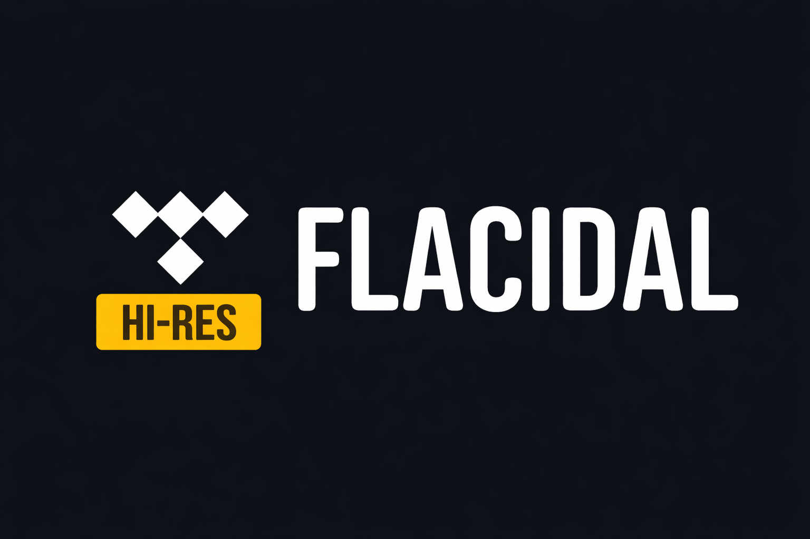
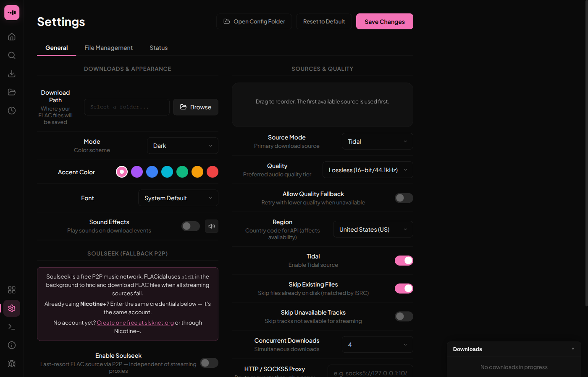
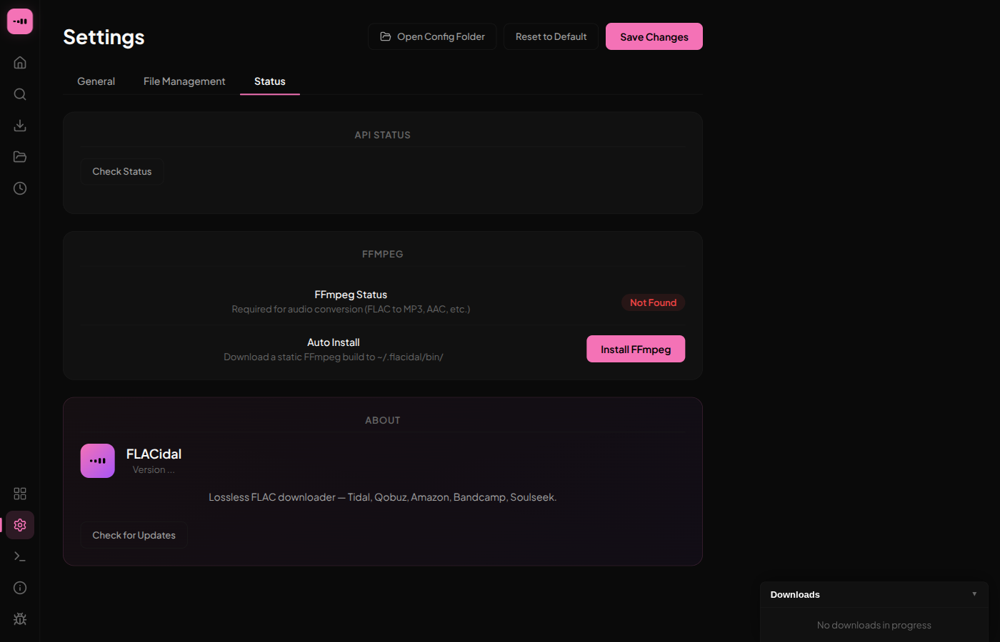
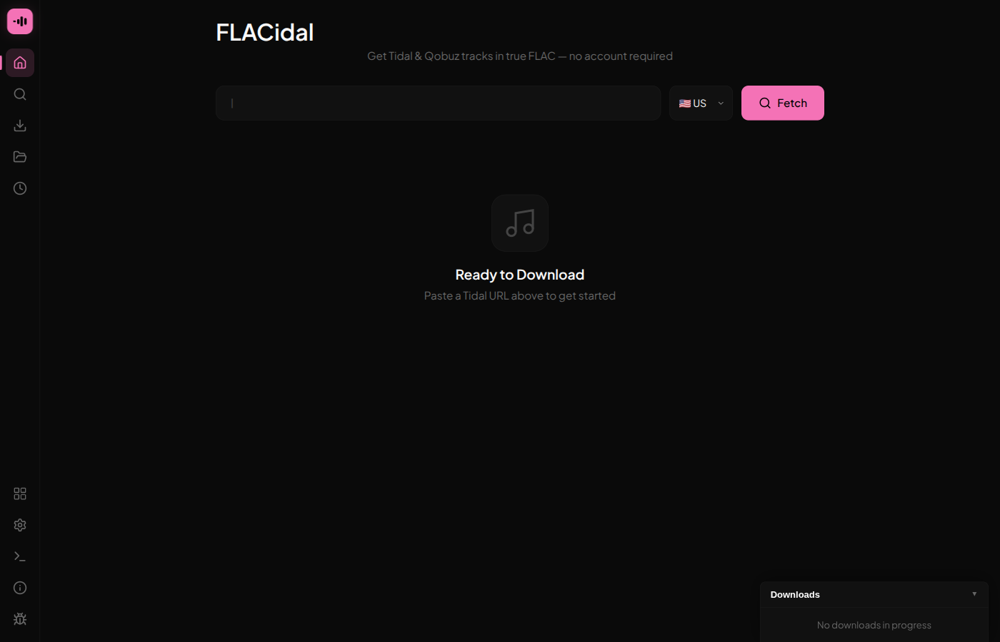
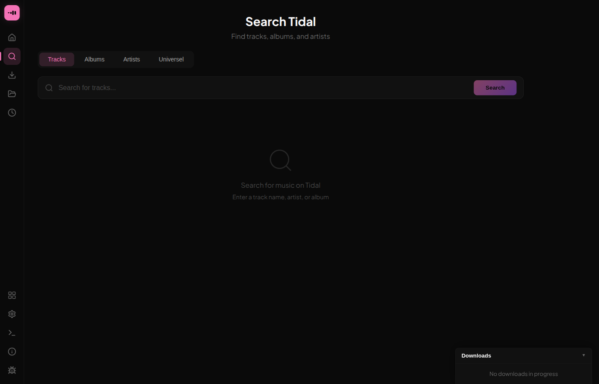
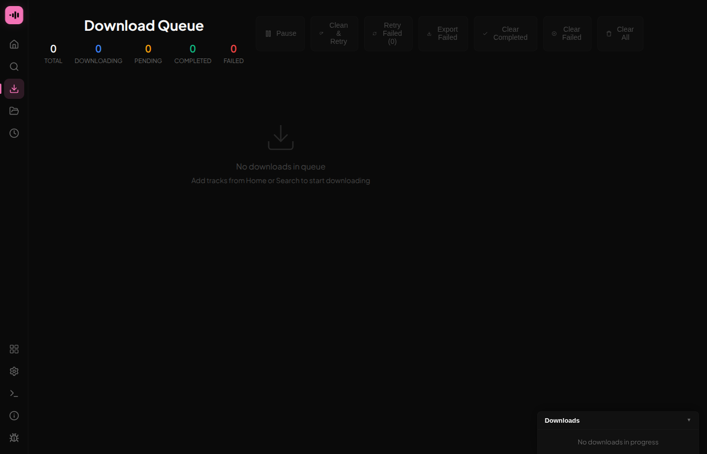
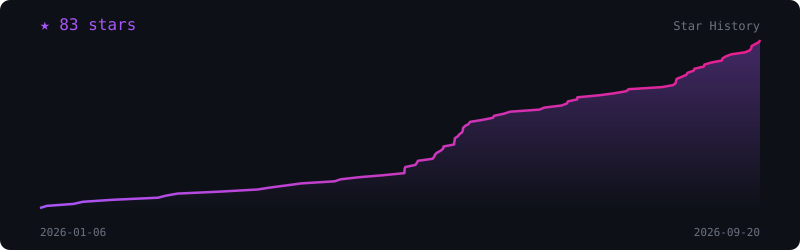

<div align="center">



### Download lossless FLAC music — multi-source, Soulseek P2P backbone

[](https://github.com/kushiemoon-dev/FLACidal/releases/latest)
[](https://github.com/kushiemoon-dev/FLACidal/stargazers)
[](LICENSE)
[](https://go.dev)


</div>

---

## Overview

**FLACidal** is a desktop app for grabbing lossless FLAC files complete with full metadata and embedded cover art. It works through several sources in turn — Soulseek P2P, Tidal, Qobuz, Amazon Music, and Bandcamp — falling back automatically until one comes through.

> **Note:** Tidal, Qobuz, and Amazon have locked down their APIs considerably against third-party access. The community proxy pools that let FLACidal reach them drop offline on a regular basis, sometimes for days. **Right now, Soulseek is the source you can count on** — no proxy pool dependency at all, and it takes roughly 5 minutes to configure. Tidal is tried first by default (see [source order](#download-chain) below); if you'd rather have Soulseek take priority over the proxy-dependent sources, move it to the top under **Settings -> General -> Source Mode**.

---

## Quick Start

**1. [Download FLACidal](#download) for your platform**

**2. [Set up Soulseek](#setting-up-soulseek) first — it matters**

**3. Paste a URL or run a search, then hit download**

```
Home tab  ->  paste a Tidal or Qobuz URL  ->  Fetch  ->  Download All FLAC
Search tab  ->  search by track / album / artist  ->  Download
```

Anytime, check **Settings -> Status** to see which sources are online.

---

## How It Works

### Download chain

Sources are attempted one at a time, in order, until one works:

| Priority | Source | Quality | Notes |
|----------|--------|---------|-------|
| 1 | **Tidal** | FLAC / Hi-Res (24-bit) | Through the community proxy pool |
| 2 | **Qobuz** | FLAC / Hi-Res (24-bit) | Through the community proxy pool — optional |
| 3 | **Amazon Music** | FLAC / UHD | Through the community proxy pool |
| 4 | **Bandcamp** | FLAC | Direct |
| 5 | **Soulseek P2P** | FLAC | Through `sldl` — needs a free account |

You can reorder sources under **Settings -> General -> Source Mode**; whatever order you set is followed top to bottom with no exceptions. Because the proxy pools go down so often, plenty of users put Soulseek first for reliability's sake.

### Two things called "proxy" — they are different

**Community proxy pool** — the relay infrastructure FLACidal maintains for Tidal, Qobuz, and Amazon. It's built-in and needs no setup from you. If these servers go down, those sources stop working.

**Outbound proxy (HTTP / SOCKS5)** — your own network proxy (a corporate VPN, a SOCKS5 tunnel, etc.) that FLACidal's traffic can be routed through. Most people won't need this. Set it up under **Settings -> General -> HTTP / SOCKS5 Proxy**.

### Self-hosted / private endpoints

Every FLACidal user shares the community proxy pool — which is precisely why it struggles: rate limits and cooldowns hit everyone simultaneously. Running your own Tidal HiFi API or Qobuz proxy instance and pointing FLACidal at it means it's **tried before the community pool**, with no shared rate-limit waiting and no reliance on pool uptime.

Set this up under **Settings -> General**:

- `tidalPriorityEndpoints` — one or more self-hosted Tidal HiFi API URLs, tried in order ahead of the public pool
- `qobuzPriorityEndpoints` — one or more self-hosted Qobuz proxy URLs, tried in order ahead of the public pool
- `amazonPriorityEndpoints` — one or more self-hosted Amazon proxy URLs, tried in order ahead of the public pool

For backward compatibility, Tidal and Qobuz also keep their single-URL legacy fields (`tidalCustomEndpoint`, `qobuzCustomEndpoint`) — for new setups, the priority-list fields are the better choice since they allow more than one fallback instance.

Leave these blank to stick with the default community pool.

### Source availability — what to expect

Major streaming platforms actively fight unofficial API access, which means:

- Proxy pools may drop offline with no warning
- Downloads can quietly fall through to Soulseek as a last resort
- **Right now, Soulseek is the most consistently available source**

You can check endpoint health live at any time under **Settings -> Status**.

---

## Features

- **Multi-Source Fallback** — automatic cascade across Soulseek, Tidal, Qobuz, Amazon, and Bandcamp
- **Soulseek P2P** — unaffected by streaming-proxy uptime; put it first in Source Mode for the most reliable results
- **Smart Dedup** — skips anything already on disk (matched by ISRC), checking every source plus an optional external library path (a Navidrome/Jellyfin library, say)
- **Jellyfin Integration** — kicks off a library scan automatically once a download batch wraps up
- **Hi-Res and Lossless** — from streaming sources: 24-bit up to 192 kHz (Hi-Res) and 16-bit / 44.1 kHz (Lossless)
- **Tidal and Qobuz** — full coverage of playlists, albums, tracks, mixes, and artist pages
- **Built-in Search** — search Tidal (Tracks / Albums / Artists) or Deezer through the Universel tab (still works when Tidal is down)
- **Concurrent Downloads** — run up to 10 downloads in parallel with live queue progress
- **Smart Metadata** — Vorbis comment tags, embedded cover art, and lyrics
- **Audio Tools Suite** — Quality Analyzer, Resampler, Converter (FFmpeg-powered), and File Manager
- **Custom Filename Templates** — set your own naming format, e.g. `{artist} - {title}`
- **Artist Artwork** — grab artist profile pictures alongside the music
- **Source Status Panel** — live endpoint health under Settings -> Status
- **Outbound Proxy Support** — HTTP and SOCKS5 for every outbound request

---

## Download

**[Download Latest Release](https://github.com/kushiemoon-dev/FLACidal/releases/latest)**

| Platform | File |
|----------|------|
| Windows x64 | `flacidal.exe` |
| macOS Universal | `flacidal.dmg` |
| Linux x64 | `flacidal.AppImage` |
| **Android** | [`FLACidal.apk`](https://github.com/kushiemoon-dev/flacidal-mobile/releases/latest) |
| **iOS** | [`FLACidal.ipa`](https://github.com/kushiemoon-dev/flacidal-mobile/releases/latest) (via AltStore) |

> **Linux:** There's no AUR package. Grab the AppImage directly, or [build from source](#build-from-source).

An Android and iOS build exists too: **[FLACidal Mobile](https://github.com/kushiemoon-dev/flacidal-mobile)**

Find every release on [GitHub](https://github.com/kushiemoon-dev/FLACidal/releases)

---

## Setting up Soulseek

Soulseek is, right now, FLACidal's most dependable source. Getting it running takes about 5 minutes.

### Step 1 — Get a Soulseek account

- **Already using Nicotine+?** Just use your existing username and password — FLACidal shares the same account system.
- **New user:** Sign up for a free account at [slsknet.org](https://www.slsknet.org/) (no email needed) or through the Nicotine+ app.

### Step 2 — Install sldl

`sldl` (slsk-batchdl) is the command-line tool FLACidal relies on to talk to the Soulseek network.

1. Grab the latest binary for your platform from [github.com/fiso64/slsk-batchdl/releases](https://github.com/fiso64/slsk-batchdl/releases)
2. Drop it at this exact path:
   - **Linux / macOS:** `~/.local/share/flacidal/sldl` — then mark it executable: `chmod +x ~/.local/share/flacidal/sldl`
   - **Windows:** `%APPDATA%\flacidal\sldl.exe` (i.e. `C:\Users\YourName\AppData\Roaming\flacidal\sldl.exe`)

FLACidal picks up the binary on its own. Once found, the Soulseek section under **Settings -> General** shows a green checkmark.

### Step 3 — Connect your account

1. Open FLACidal -> **Settings -> General**
2. Scroll to **Soulseek (Fallback P2P)**
3. Switch **Enable Soulseek** on
4. Fill in your **username** and **password**
5. Click **Login** — FLACidal checks the connection live and reports success or an error
6. Click **Save Changes**

<div align="center">

</div>

### Step 4 — Verify in Settings -> Status

Head to **Settings -> Status**. The `sldl` row ought to be green. Should any proxy pool endpoints turn red, Soulseek picks up the slack automatically.

<div align="center">

</div>

---

## Usage

### Home — download by URL

<div align="center">

</div>

1. **Paste a URL** into the field and hit **Fetch**
2. FLACidal pulls the track list and shows it on screen
3. Click **Download All FLAC** to add the tracks to the Queue
4. URLs you've fetched before show up as cards under the input, ready for a quick re-download

**Supported URL types:**

| Service | Types |
|---------|-------|
| **Tidal** | Playlist · Album · Track · Mix · Artist |
| **Qobuz** | Album · Playlist · Track |
| **Spotify** | Track · Album · Playlist (metadata only — routed to Tidal/Qobuz/Amazon/Soulseek for the actual FLAC) |
| **Deezer** | Track · Album · Playlist |

**Other services (Apple Music, YouTube Music, Deezer short links, ...):** FLACidal can't parse these directly, but it resolves them automatically through [Odesli/song.link](https://song.link) into an equivalent Tidal or Deezer URL before fetching — just paste the link, nothing extra required.

### Search — find music without leaving the app

<div align="center">

</div>

Open the **Search** tab, where four sub-tabs live:

| Tab | What it searches | Works when Tidal is down? |
|-----|-----------------|:---:|
| **Tracks** | Tidal track catalog | No |
| **Albums** | Tidal album catalog | No |
| **Artists** | Tidal artist pages | No |
| **Universel** | Deezer public catalog (by ISRC) | Yes |

**Universel** runs on Deezer's public API, so it keeps working regardless of Tidal proxy health — reach for it whenever a Tidal search comes up empty.

### Queue — monitor and control downloads

<div align="center">

</div>

The **Queue** tab lists every active and pending download:

- A live progress bar per track
- **Pause / Resume** for the whole queue at once
- **Retry** a single failed download, or retry every failure in one go
- An export option for the list of failed downloads

### History and Files

**History** logs every download and URL fetch — click any past entry to re-fetch it instantly.

**Files** shows every FLAC file in your download folder, with a button to open the folder in your system's file manager.

### Audio Tools

Reach the Tools panel through the grid icon in the sidebar:

| Tool | What it does |
|------|-------------|
| **Quality Analyzer** | Examines actual frequency content to confirm true lossless status, and reports BPM/musical key |
| **Resampler** | Adjusts sample rate (192 kHz down to 44.1 kHz, for instance) |
| **Converter** | Transcodes to other formats (MP3, AAC, Opus) through FFmpeg |
| **File Manager** | Batch-renames files based on metadata templates |

Converter, Resampler, and the Quality Analyzer's lossless check all need FFmpeg — get it through your system's package manager, or use the in-app installer under **Settings -> Status**.

The Quality Analyzer's BPM/key detection needs [`aubio`](https://aubio.org/) and [`keyfinder-cli`](https://github.com/EvanPurkhiser/keyfinder-cli) available on PATH — both optional (on Arch, for example: `pacman -S aubio libkeyfinder`, then `yay -S keyfinder-cli` for the AUR package). Skip them and BPM/key just show blank; the rest of the analysis proceeds regardless.

---

## Output Structure

```
~/Music/
└── Playlist Name/
    ├── Artist - Track One.flac
    ├── Artist - Track Two.flac
    └── cover.jpg
```

Both the download folder and the filename template can be fully customized under **Settings -> File Management**.

---

## Configuration

Settings live at `~/.flacidal/config.json` and can be edited from within the app via the Settings panel. The **Open Config Folder** button in Settings jumps straight to that directory.

| Setting | Default | Options |
|---------|---------|---------|
| Quality | `Lossless` | `Hi-Res` (24-bit/48kHz+) · `Lossless` (16-bit/44.1kHz) · `High` (320kbps, lossy) |
| File naming | `{artist} - {title}` | Custom template with metadata variables |
| Embed cover art | `true` | `true` · `false` |
| Concurrent downloads | `4` | `1` – `10` |
| Outbound proxy | _(none)_ | `http://host:port` or `socks5://host:port` |

The config file sits at `~/.flacidal/config.json`, while the `sldl` binary lives separately at `~/.local/share/flacidal/sldl` on Linux and macOS — two distinct locations, worth not confusing.

---

## Build from Source

**Requirements:** [Go](https://go.dev) 1.26+ and [Wails v2](https://wails.io)

```bash
go install github.com/wailsapp/wails/v2/cmd/wails@latest
git clone https://github.com/kushiemoon-dev/FLACidal.git
cd FLACidal
wails build
# Binary: build/bin/flacidal
```

For hot-reload development mode:

```bash
wails dev
```

---

## Headless / Run in browser

FLACidal can run as a plain HTTP server too — no Wails, no desktop shell — steerable from any browser on the machine (or the LAN). Handy for a NAS, a home server, or wherever a desktop UI doesn't fit.

### Docker

The image bundles the server, the built frontend, `ffmpeg`, `aubio` (BPM), and `sldl` (Soulseek), so nothing extra needs installing. `keyfinder-cli` (musical key) isn't bundled yet — there's no Debian package for it and it needs a source build, so key detection stays empty in Docker for now.

```bash
curl -O https://raw.githubusercontent.com/kushiemoon-dev/FLACidal/main/docker-compose.yml
docker compose up -d
```

Then open `http://localhost:8080`. Downloads go to `./music/FLACidal`, while config and the database persist across restarts in the `flacidal-config` volume. Port and volume layout details are in [docker-compose.yml](docker-compose.yml).

### From source

```bash
git clone https://github.com/kushiemoon-dev/FLACidal.git
cd FLACidal
cd frontend && npm install && npm run build && cd ..
go run ./cmd/server
# or: make serve
```

Then open `http://localhost:8080`.

The server reads from the same `~/.flacidal/config.json` as the desktop app. It's controlled by two optional environment variables:

| Variable | Default | Purpose |
|----------|---------|---------|
| `PORT` | `8080` | HTTP port the server listens on |
| `FRONTEND_DIST_DIR` | `frontend/dist` | Where to find the built SPA on disk |

Running `go run ./cmd/server` before the frontend is built is fine — the server still comes up and the API works on its own — but requests to `/` return a 503 nudging you to run `npm run build` first.

---

## FAQ

**Is a Tidal or Qobuz account required?**
Not for the streaming sources — FLACidal handles authentication itself through the community proxy pools. A Soulseek account is a different story: Soulseek P2P needs one, and given how the proxies have been behaving, setting one up (free) is strongly worth doing.

**Everything fails or times out — nothing downloads. What now?**
Check **Settings -> Status**. Red proxy pool endpoints mean the streaming sources are down right now — expected, and usually temporary. Confirm Soulseek is set up (see [Setting up Soulseek](#setting-up-soulseek)), since it doesn't depend on proxy pool health at all.

**What quality can I actually expect?**
Tidal gives Hi-Res (24-bit, up to 192 kHz) or Lossless (16-bit, 44.1 kHz). Qobuz goes up to 24-bit depending on what's available for the album. Soulseek depends entirely on what other users are sharing — FLACidal specifically searches for FLAC there.

**My antivirus is flagging the binary — why?**
That's a false positive; heuristic scanners sometimes flag Go binaries for no real reason. Build from source instead if it bothers you.

**What does the outbound proxy setting do, and do I need it?**
It sends FLACidal's traffic through a personal proxy — a corporate VPN, a SOCKS5 tunnel, whatever you use. Most people can skip it entirely. It has nothing to do with the community proxy pool that Tidal and Amazon rely on.

**Does Arch Linux get an AUR package?**
It does — `flacidal-bin`. Install with `yay -S flacidal-bin` or `paru -S flacidal-bin`. It just wraps the same `.AppImage` found on the releases page.

---

## Star History

<div align="center">

[](https://github.com/kushiemoon-dev/FLACidal/stargazers)

</div>

---

## Disclaimer

FLACidal exists strictly for **educational and personal use**. It has no affiliation with, endorsement from, or connection to Tidal, Qobuz, or any other streaming service. Making sure your use stays within local law and each platform's Terms of Service is entirely on you. The software comes "as is," with no warranty of any kind.

---

<div align="center">

**MIT License** · [Releases](https://github.com/kushiemoon-dev/FLACidal/releases) · [Mobile App](https://github.com/kushiemoon-dev/flacidal-mobile) · [YouFLAC](https://github.com/kushiemoon-dev/YouFLAC) · [OpenDrop-VJ](https://github.com/kushiemoon-dev/OpenDrop-VJ)

Built with love by [KushieMoon](https://github.com/kushiemoon-dev)

</div>
